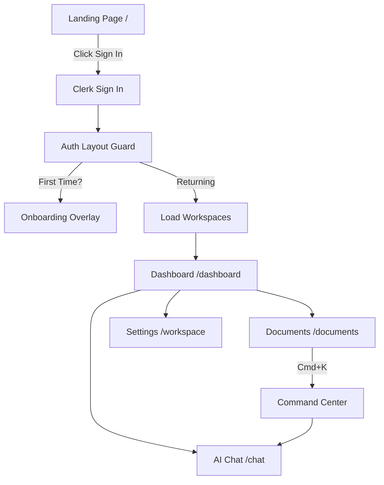

# Application Flow

This document maps how a user moves through the Clarity frontend.

## The Complete Lifecycle

### 1. Entry & Authentication
Users land on `/` (Landing Page). When they click "Dashboard" or "Sign In", they are routed to Clerk's managed `/sign-in` route. Upon successful authentication, they are redirected to `/dashboard`.

### 2. The Auth Guard
`src/app/(auth)/layout.tsx` acts as the gatekeeper. It checks `auth()` from Clerk. If no `userId` exists, it forces a redirect back to `/`. If they are authenticated, it renders the `DarkAppLayout`.

### 3. Context Initialization (Hydration)
As the `DarkAppLayout` mounts, the `WorkspaceProvider` initializes. It fetches the user's workspaces from the backend (`getMe`). It checks `localStorage` for the last active workspace ID and sets `activeWorkspace`.

### 4. Navigation & Shell
The user is presented with the `DarkSidebar` and `DarkTopbar`. The central area is handled by Next.js routing, wrapped in `AnimatePresence` to ensure smooth fade-ins and fade-outs between pages.

### 5. Document Ingestion Flow
1. User navigates to `/documents`.
2. User clicks "Upload".
3. A modal appears (or global upload triggers). The frontend converts the file to `FormData` and posts to the API.
4. The React Query cache for `['documents']` is invalidated, instantly updating the UI.

### 6. Developer Console Flow
For power users, `/developer/dashboard` provides a deep dive. It fetches pipeline metrics via `useDashboardMetrics` and visualizes them using custom SVG/Canvas components (`PipelineVisualizer.tsx`).
