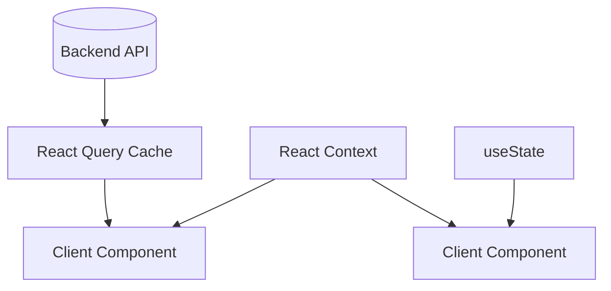

# State Management

We use a combination of TanStack Query (React Query) and React Context. We explicitly avoid Redux to prevent boilerplate.

## React Query (Server State)
Used for anything that lives on the server (Documents, Metrics, Chat History).
- **Hooks**: Found in `src/hooks/`.
- **Keys**: Every query key MUST include the `workspaceId` (e.g., `['documents', activeWorkspace?.id]`). This ensures that switching workspaces instantly invalidates and swaps the data.
- **Mutations**: Deletions and creations use `useMutation` and call `queryClient.invalidateQueries()` on success.

## Context API (Global App State)
Used for UI state that spans multiple branches of the component tree.
- **`WorkspaceContext`**: The heart of the app. Stores the `workspaces` array and the `activeWorkspace`. Persists the active ID to `localStorage` so users don't lose context on refresh.
- **`UIContext`**: Tracks `sidebarCollapsed` (desktop) and `sidebarOpen` (mobile).
- **`CommandContext`**: Exposes a `toggle()` function to open the Cmd+K palette from anywhere (like the sidebar).

## Component State (`useState`)
Used for strictly local state.
- Form inputs.
- Active tabs (e.g., `activeTab` in `WorkspaceTab.tsx`).
- Modal open/close flags.
